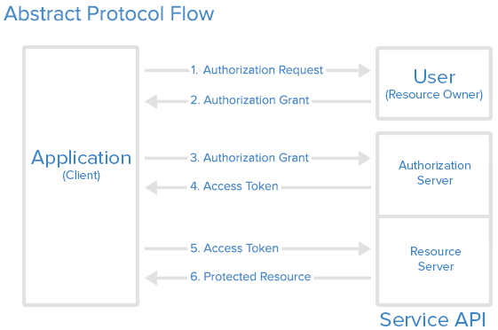
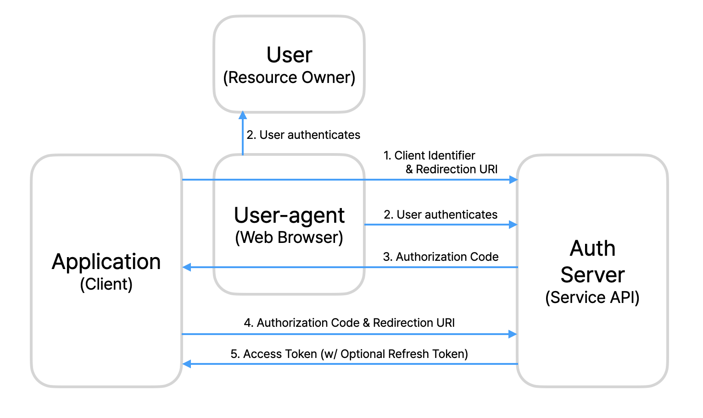
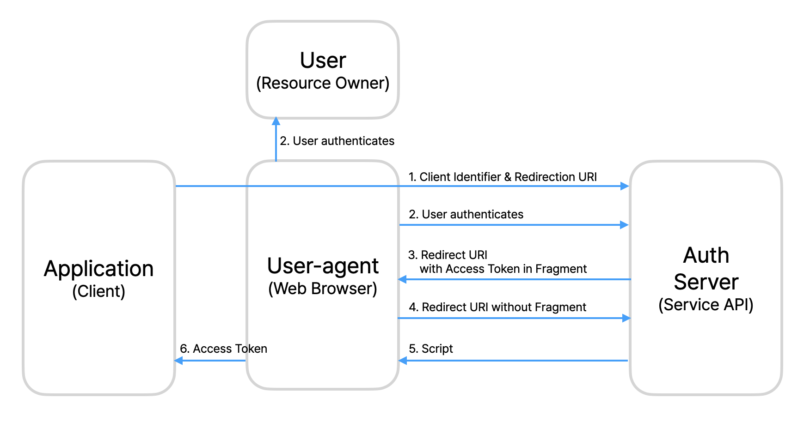
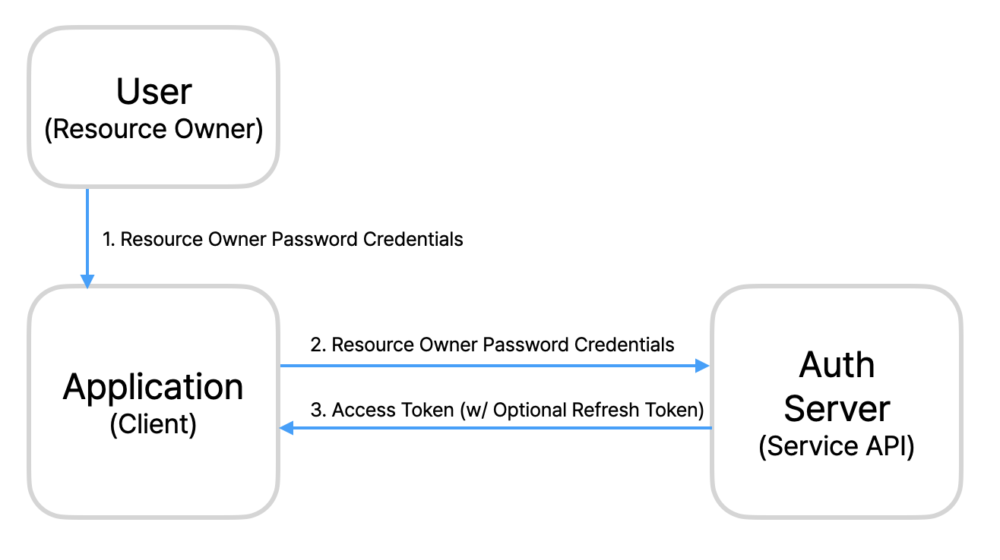
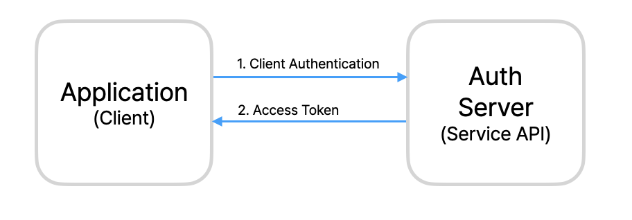
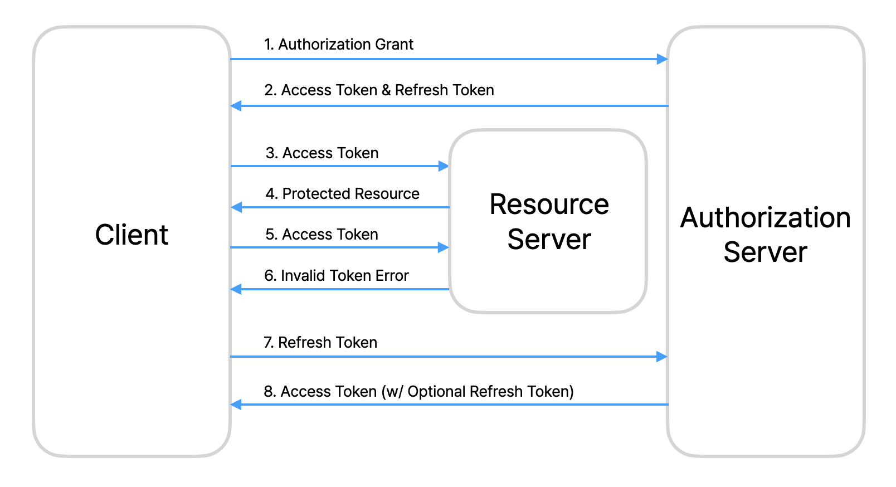

# OAuth 2.0

## What is OAuth 2.0?

OAuth 2.0, which stands for “Open Authorization”, is a standard designed to allow a website or application to access resources hosted by other web apps on behalf of a user. OAuth 2.0 provides consented access and restricts actions of what the client app can perform on resources on behalf of the user, without ever sharing the user's credentials.

## **How Does OAuth 2.0 Work?**

### **Roles**

Before we take a look at how it works, let's take a look at the roles specified as standards in OAuth2.0.

These define the essential components of an OAuth 2.0 system, and are as follows:

- **Resource Owner** is the user or system that owns the protected resources and can grant access to them.
- The **Client** is the system that requires access to the protected resources. To access resources, the Client must hold the appropriate Access Token.
- **Authorization Server** receives requests from the Client for Access Tokens and issues them upon successful authentication and consent by the Resource Owner. The authorization server exposes two endpoints: the Authorization endpoint, which handles the interactive authentication and consent of the user, and the Token endpoint, which is involved in a machine to machine interaction.
- **Resource Server** that protects the user’s resources and receives access requests from the Client. It accepts and validates an Access Token from the Client and returns the appropriate resources to it.

### OAuth 2.0 Protocol Flow

*[https://www.digitalocean.com/community/tutorials/an-introduction-to-oauth-2](https://www.digitalocean.com/community/tutorials/an-introduction-to-oauth-2)*

1. The *application* requests authorization to access service resources from the *user*
2. If the *user* authorized the request, the *application* receives an authorization grant
3. The *application* requests an access token from the *authorization server* (API) by presenting authentication of its own identity, and the authorization grant
4. If the application identity is authenticated and the authorization grant is valid, the *authorization server* (API) issues an access token to the application. Authorization is complete.
5. The *application* requests the resource from the *resource server* (API) and presents the access token for authentication
6. If the access token is valid, the *resource server* (API) serves the resource to the *application*

## Grant Type

To request an access token, the client obtains authorization from the resource owner. The authorization is expressed in the form of an authorization grant, which the client uses to request the access token.

OAuth defines four grant types: authorization code grant type, implicit grant type, resource owner password credentials grant type, and client credentials grant type.

1. **Authorization Code Grant Type**

   

   The client receives autorization code to obtain both access tokens and refresh tokens. During the process of receiving the authorization code, the resource owner’s user-agent, typically a web browser, interacts with both the client and authorization server.

   1) The client initiates the flow by directing the resource owner’s user-agent to the authorization endpoint. The client includes its client identifier, requested scope, local state, and a redirection URI.

   2) The authorization server authenticates the resource owner (via the user-agent).

   3) Assuming the resource owner grants access, the authorization server redirects the user-agent back to the client using the redirection URI provided earlier.

   4) The client requests an access token from the authorization server’s token endpoint by including the authorization code received in the previous step.

   5) If the authorization code valid, the authorization server responds back with an access token and, optionally, a refresh token.

2. **Implicit Type**

   

   Unlike the authorization code grant type, the implicit type doesn’t use the authorization code. Insted, this type sends the access token in the URI fragment of a redirect URI.

3. **Resource Owner Password Credentials Grant Type**

   

   This type generates the access token using the resource owner’s credentials (such as username or password).

4. **Client Credentials Grant Type**

   

   The client can request an access token using only its client credentials (or other supported means of authentication).

## Access Token & Refresh Token

Access tokens are credentials used to access protected resources. An access token is a string representing an authorization issued to the client. The string is usually opaque to the client. Tokens represent specific scopes and durations of access, granted by the resource owner, and enforced by the resource server and authorization server.

Refresh tokens are credentials used to obtain access tokens. Refresh tokens are issued to the client by the authorization server and are used to obtain a new access token when the current access token becomes invalid or expires, or to obtain additional access tokens with identical or narrower scope. Access tokens may have a shorter lifetime and fewer permissions than authorized by the resource owner. Issuing a refresh token is optional at the discretion of the authorization server. If the authorization server issues a refresh token, it is included when issuing an access token.

Since we have already explained the process of issuing an access token, we can start from the step 5, where the access token is either invalid or has expired.

In step 5, when the access token is expired, the client receives an invalid token error in step 6. To obtain a new access token, the client uses the refresh token. The client requests the refresh token from the authorization server, which returns a new access token along with an optional new refresh token.

## References

- [RFC 6749: The OAuth 2.0 Authorization Framework](https://www.rfc-editor.org/rfc/rfc6749)
- [What is OAuth and How Does it Work?](https://www.techtarget.com/searchapparchitecture/definition/OAuth)
- [What is OAuth 2.0 and what does it do for you? - Auth0](https://auth0.com/intro-to-iam/what-is-oauth-2)
- [An Introduction to OAuth 2  | DigitalOcean](https://www.digitalocean.com/community/tutorials/an-introduction-to-oauth-2)
