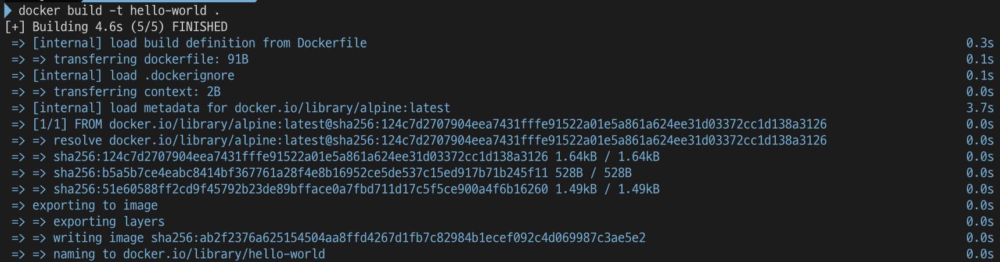
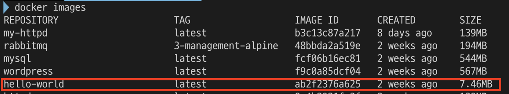

# Docker

## What is Container?

Before we look into Docker, let's suppose when we publish a web application.

- buy a server
- install Linux
- set up the software technology to build websites and web applications
    - the operating system, the web server, the database server and the programming language
- run the app

In additional, if your app got popular, you practiced good load balancing by setting up a second server to ensure the application wouldn't crash from too much traffic.

Times have changed, though, and instead of focusing on single servers, the Internet is built upon arrays of inter-dependent and redundant servers in "the cloud". These software-based servers are called **containers**.

→ Containers are packages of software that contain all the necessary elements to run in any environment.

## Container vs. VM(Virtual Machine)


*[https://www.weave.works/blog/a-practical-guide-to-choosing-between-docker-containers-and-vms](https://www.weave.works/blog/a-practical-guide-to-choosing-between-docker-containers-and-vms)*

Containers and virtual machines are very similar resource virtualization technologies. Virtualization is the process in which a system singular resource like RAM, CPU, Disk, or Networking can be ‘virtualized’ and represented as multiple resources. The key differentiator between containers and virtual machines is that virtual machines virtualize an entire machine down to the hardware layers and containers only virtualize software layers above the operating system level.

### Advantages of Containers

- Lightweight: Containers share the machine OS kernel, eliminating the need for a full OS instance per application and making container files small and easy on resources.
- Portable and platform-independent: Containers carry all their dependencies with them, so software can be written once and then run without needing to be re-configured.
- Supports modern development and architecture: containers are an ideal fit for modern development and application patterns(DevOps, serverless and microservices) that are built using regular code deployments in small increments.
- Imporves utilization: Like VMs before them, containers enable developers and operators to improve CPU and memory utilization of physical machines.

## What is Docker?

Docker is the virtualization platform that is based on containers. Docker enables you to separate your applications from your infrastructure so you can deliver software quickly. With Docker, you can manage your infrastructure in the same ways you manage your applications.

By taking advantage of Docker’s methodologies for shipping, testing, and deploying code quickly, you can significantly reduce the delay between writing code and running it in production.

When using Docker, various objects such as images, containers, networks, volumes, plugins, and others are created and utilized. In this topic, we will primarily focus on images and containers.

### Docker Image

A Docker image is a **read-only template** that contains a set of instructions for creating a container that can run on the Docker platform. It provides a convenient way to package up applications and preconfigured server environments, which you can use for your own private use or share publicly with other Docker users.

### Docker Container

A container is a runnable instance of an image. You can create, start, stop, move, or delete a container. You can connect a container to one or more networks, attach storage to it, or even create a new image based on its current state.

By default, a container is relatively well isolated from other containers and its host machine. You can control how isolated a container’s network, storage, or other underlying subsystems are from other containers or from the host machine.


*[https://jfrog.com/knowledge-base/a-beginners-guide-to-understanding-and-building-docker-images/](https://jfrog.com/knowledge-base/a-beginners-guide-to-understanding-and-building-docker-images/)*

## Examples

Let’s create images and run containers. This is an example that simply prints 'Hello, World'.

1. Write a *Dockerfile*

```docker
FROM alpine:latest
CMD ["echo", "Hello, World"]
```
- Write a list consisting of images in a *Dockerfile*.

2. Create an image

```bash
$ docker build -t hello-world .
```



- Build the Dockerfile and create an image.



- Generating images can be shown by the `docker images` command.

3. Run a container

```bash
docker run hello-world
```

- Run a container based on a image.


## References

- [What is Docker?](https://opensource.com/resources/what-docker)
- [Docker overview](https://docs.docker.com/get-started/overview/)
- [What is a Container? | Docker](https://www.docker.com/resources/what-container/)
- [Containers vs Virtual Machines | Atlassian](https://www.atlassian.com/microservices/cloud-computing/containers-vs-vms)
- [What are containers?  | IBM](https://www.ibm.com/topics/containers)
